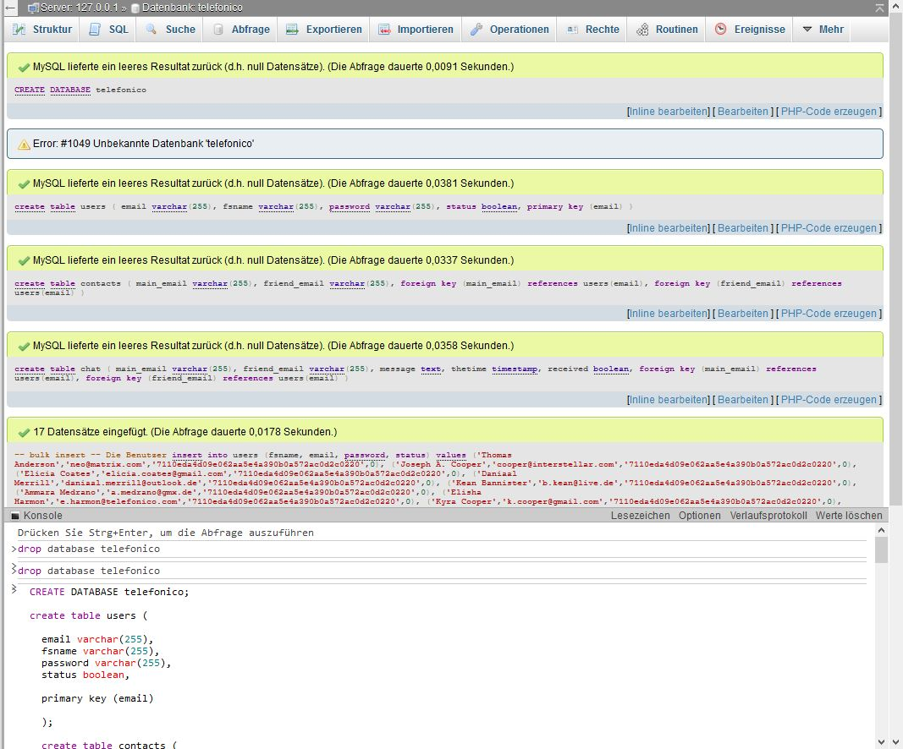
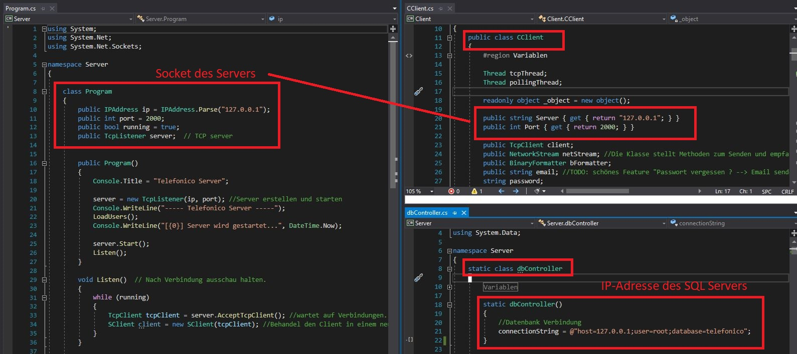
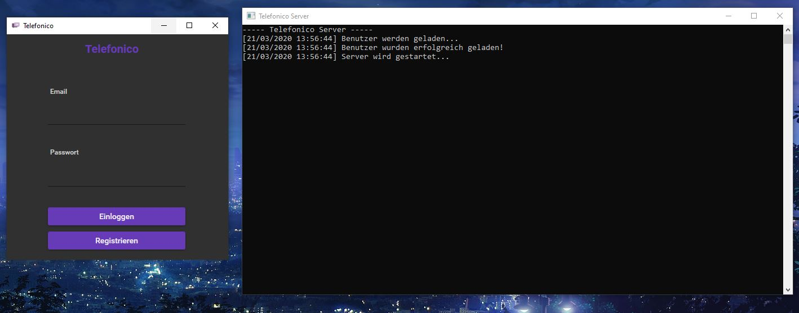
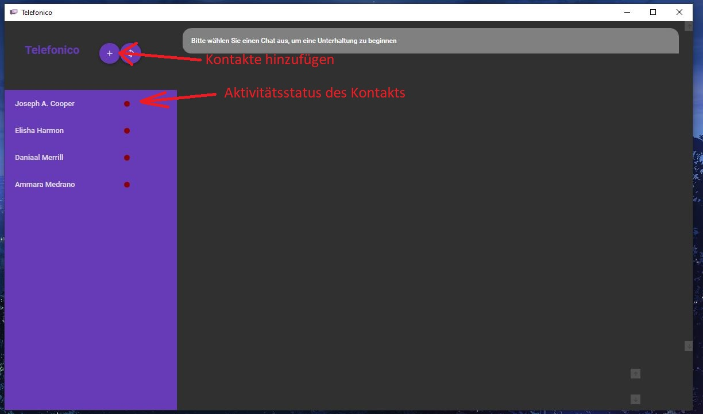
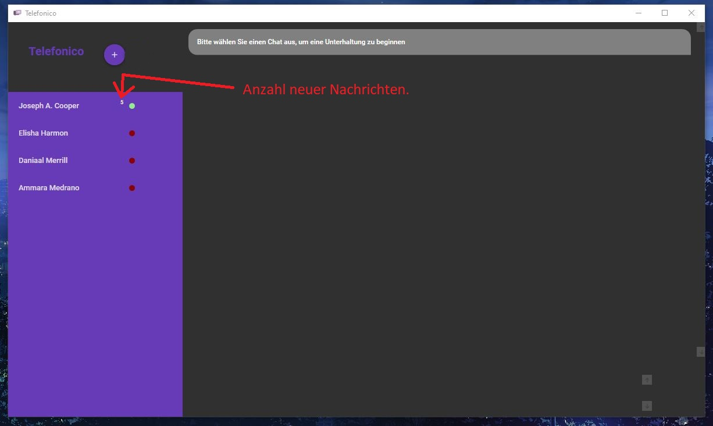
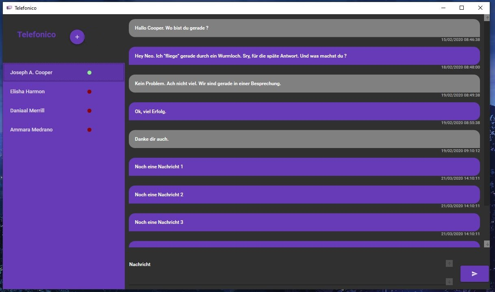
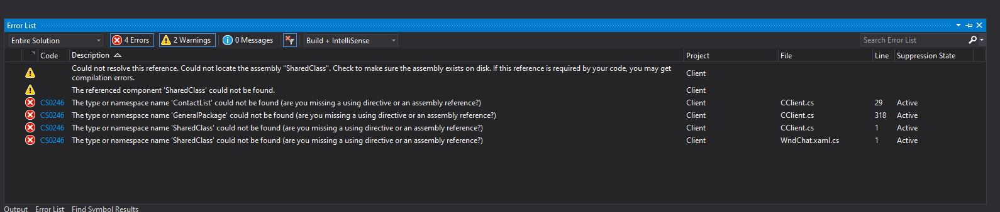

# Telefonico

## Inhaltsverzeichnis

- [Telefonico](#telefonico)
  * [Inhaltsverzeichnis](#inhaltsverzeichnis)
  * [Einrichten](#einrichten)
    + [Adressen festlegen](#adressen-festlegen)
  * [Testdaten](#testdaten)
  * [Server und Client starten](#server-und-client-starten)
  * [Chat](#chat)
  * [Known bugs](#known-bugs)

## Einrichten

Bitte zuerst die Datenbank einrichten. Bitte führen Sie dafür den Code in folgender Datei aus: "datenbank/skelett.sql".

**Achtung ! Falls Sie bereits eine Datenbank mit dem Namen Telefonico haben. Bitte folgenden Befehl ausführen. `drop database telefonico;`**

### Adressen festlegen

Die Adresse können Sie in folgenden Klassen festlegen:

## Testdaten

Zum testen können Sie gerne folgende Datensätze verwenden.

| Email         | Passwort     |
|---------------|--------------|
|neo@matrix.com | 1234|
|cooper@interstellar.com | 1234|
| absender@gmail.com | 1|
| empfänger@gmail.com | 1|

## Server und Client starten

Nun können Sie den Server und den Client starten.

## Chat

Der Client fragt wiederholend in einem bestimmten Zeitintervall den Server nach neuen Nachrichten. Die Anzahl neuer Nachrichten wird in der Kontaktliste angezeigt:

## Known bugs

Falls Sie während des Kompiliervorgangs folgende Fehlermeldung erhalten:

müssen Sie zuerst das Projekt "SharedClass" kompilieren. Denn diese erstellt die DLL, welche von Client und Server benötigt werden.
